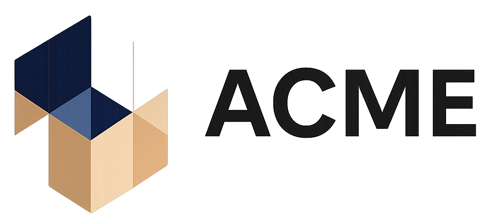

# 🏦 Banco Acme - Aplicación Web de Autogestión Bancaria

<p align="center">
  
</p>

Aplicación desarrollada como solución integral de autogestión para los usuarios del Banco Acme. Permite el registro de usuarios, la gestión de cuentas, realización de transacciones, pagos de servicios, generación de extractos y certificados. Toda la información se persiste en el navegador usando `localStorage` con estructuras JSON.

---

## 🌐 Repositorio

👉 [GitHub: Proyecto JavaScript - Camila Dangond & Hugo González](https://github.com/CamilaIvanna/ProyectoJavaScript-CamilaDangond-HugoGonzalez)

---

## 👨‍💻 Creadores

- **Hugo Andrés González**
- **Camila Ivanna Dangond**

---

## 📁 Estructura del Proyecto

---

## 🔑 Funcionalidades Principales

### 🔐 Inicio de Sesión
- Formulario con tipo/número de identificación y contraseña.
- Validación de credenciales y redirección al panel de usuario.

### 📝 Registro de Usuario
- Formulario validado en tiempo real.
- Generación automática de número de cuenta y fecha.
- Vista previa del resumen antes de guardar.

### 🔑 Recuperación de Contraseña
- Validación por número de documento y correo.
- Definición de nueva contraseña con confirmación.

### 🏠 Panel Principal del Usuario (Dashboard)
- Tarjeta resumen de cuenta.
- Módulos interactivos:
  - Transacciones recientes.
  - Consignaciones.
  - Retiros.
  - Pagos de servicios.
  - Extractos bancarios.
  - Certificados.
  - Cierre de sesión.

### 📄 Generación de Documentos
- Certificados y extractos bancarios imprimibles.
- Comprobantes de todas las transacciones realizadas.

### 💾 Persistencia de Datos
- Uso completo de `localStorage`.
- Estructuras organizadas con objetos y arreglos en JSON.

---

## 📱 Diseño y Estilo

- ✅ Totalmente **responsive**: adaptado a celulares, tablets y escritorio.
- 🎨 Diseño moderno: colores sobrios y fuentes legibles.
- 🧩 Estructura modular: CSS separados por funcionalidad.

---

## 🚀 Instrucciones para Ejecutar el Proyecto

1. Clona el repositorio:
   ```bash
   git clone https://github.com/CamilaIvanna/ProyectoJavaScript-CamilaDangond-HugoGonzalez


---

## 🔑 Funcionalidades Principales

### Inicio de Sesión
- Formulario con tipo/número de identificación y contraseña.
- Validación y redirección al `dashboard`.

### Registro de Usuario
- Formulario con validación en tiempo real.
- Generación automática de número de cuenta y fecha de creación.
- Resumen final del registro.

### Recuperación de Contraseña
- Validación por número de documento y correo electrónico.
- Generación de nueva contraseña con confirmación.

### Panel de Usuario (Dashboard)
- Tarjeta con resumen de cuenta.
- Acceso a todas las funciones principales:
  - Resumen de transacciones.
  - Consignación electrónica.
  - Retiros.
  - Pagos de servicios.
  - Generación de extracto.
  - Certificado bancario.

### Generación de Documentos
- Archivos imprimibles para:
  - Certificados
  - Extractos
  - Comprobantes de transacción

### Persistencia de Datos
- Uso de `localStorage` para guardar usuarios, cuentas, transacciones y configuraciones.

---

## 📱 Diseño y Estilo

- **Responsive**: compatible con móviles, tablets y pantallas grandes.
- **Estilos personalizados**: múltiples archivos CSS por módulo.
- **Paleta profesional**: colores institucionales, íconos y fuentes modernas.

---

## 🚀 Instrucciones para Ejecutar el Proyecto

1. Clona el repositorio:
   ```bash
   git clone https://github.com/CamilaIvanna/ProyectoJavaScript-CamilaDangond-HugoGonzalez